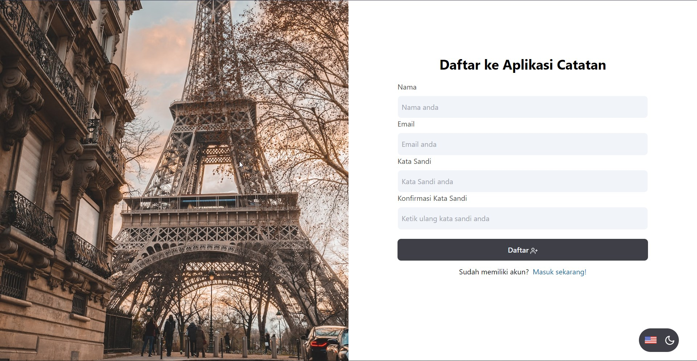
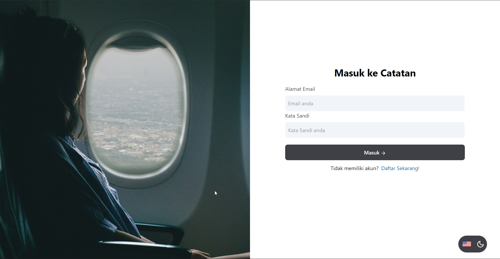
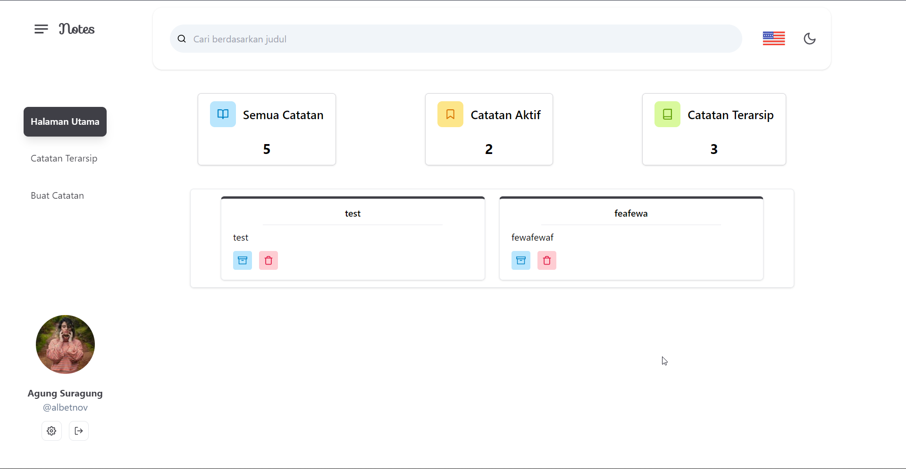
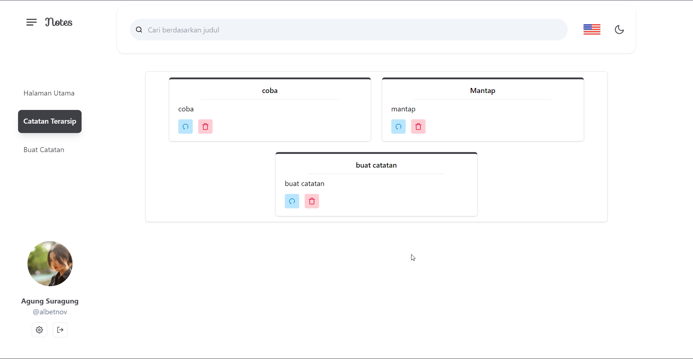
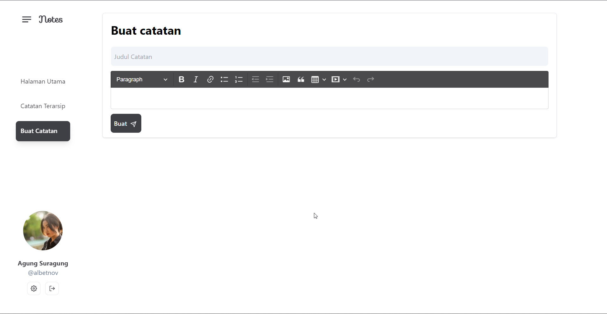
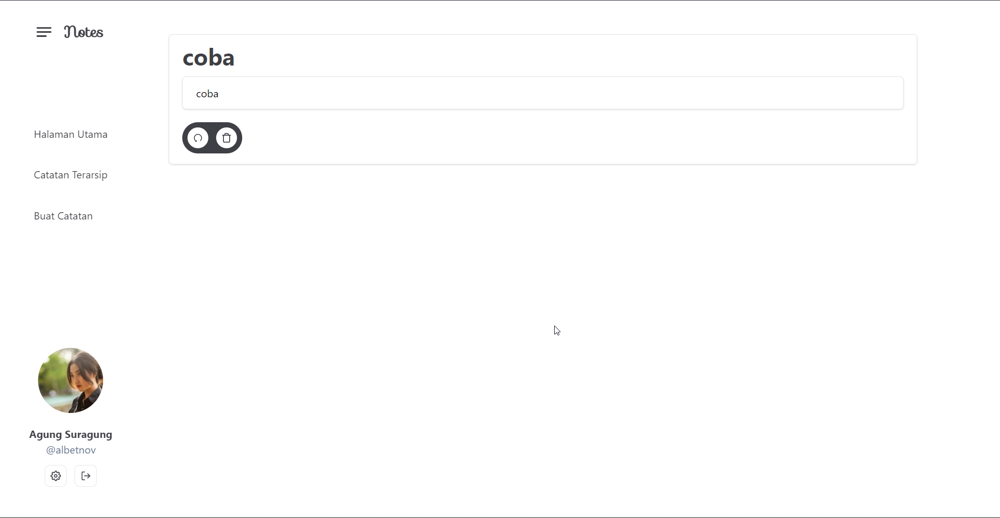
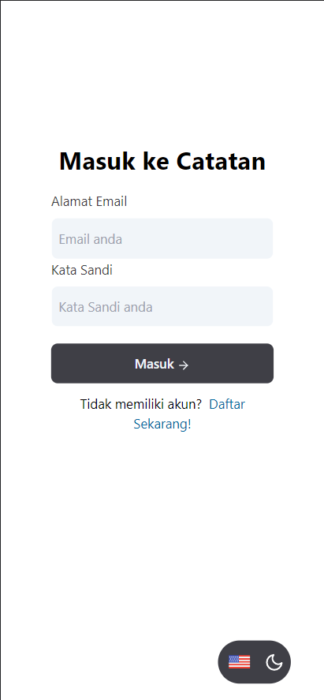
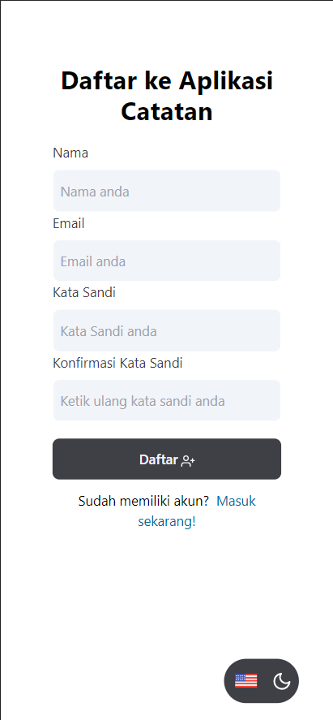
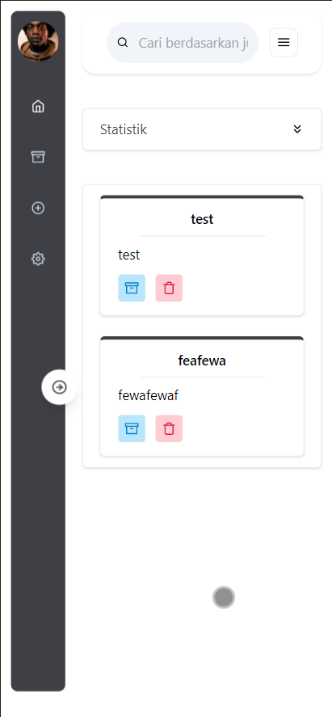
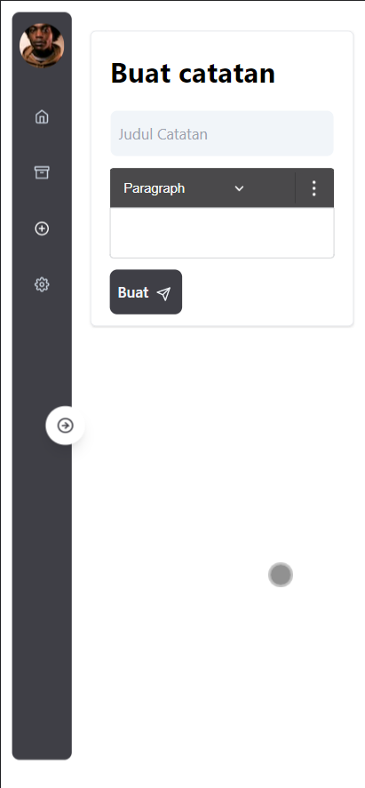

# Dicoding Submission
Merupakan sebuah website sederhana yang dibuat dengan harapan agar tuntas di Submission Belajar Fundamental Aplikasi Web dengan React Dicoding.

> Di buat oleh Albet Novendo.

# Screenshot

# Libraries

- ESLint
- TailwindCSS
- PropTypes
- HTML React Parser
- CKEditor 5